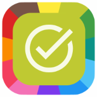

# FollowApp MyTasks

```
Streamline your tasks with MyTasks - part of the powerful FollowApps suite
```



Welcome to `FollowApp MyTasks`, a simple yet powerful task management app designed to help you reclaim your valuable free time. With `MyTasks`, you can effortlessly keep track of what needs to be done and when, ensuring you spend less time on tasks and more time on what matters to you.

As part of the `FollowApps suite`, `MyTasks` integrates seamlessly with other apps in the suite, creating a comprehensive ecosystem for managing your day-to-day activities.

Whether you’re not tech-savvy, lack resources for more sophisticated management tools, or run a one-person business providing face-to-face services, `MyTasks` is designed for you. It’s easy to use, tailored for various management needs, and part of a unique ecosystem that saves you time and reduces unnecessary interactions, leading to greater clarity and satisfaction.

Experience the simplicity and power of `FollowApp MyTasks`. Start managing your tasks more effectively today.
